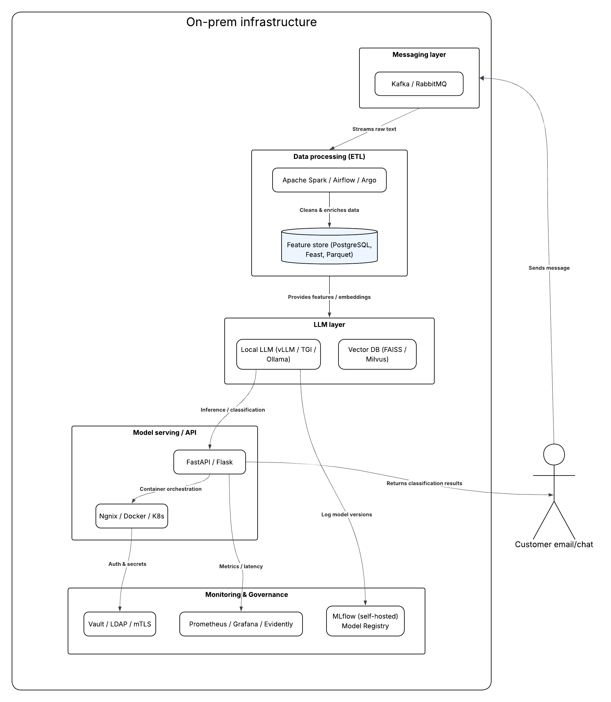

# Monitoring & Governance (MLOps)

## 1) Wersjonowanie i weryfikacja
- **MLflow Registry** - wersje promptów i modeli (artefakty: prompt templates, few-shots, params), staging -> prod
- **Unity Catalog** - governance, lineage, DLT Expectations + Great Expectations/Evidently dla jakości danych
- **A/B / shadow**: porównanie nowych promptów/modeli vs prod

## 2) Metryki produkcyjne (poza accuracy)
- **p95 latency (ms)** - SLA czatu/sync, alerty
- **Cost per classification** - tokeny `prompt+completion * cena`, alerty na skoki

# Dodatkowe: wariant on-prem

